<div align="center">


<h1>AVD Network Isolation</h1>

<p><strong>The Institutional-Grade Platform for Standardized Network foundations, Zero-Trust Governance, and Multi-Cloud EUC Ecosystems.</strong></p>

[]()
[]()
[]()

<br/>

> **"Industrializing network isolation to automate digital workplace foundations."** 
> **AVD Network Isolation** is an enterprise-grade platform designed to provide a secure, measurable, and highly automated foundation for global virtual desktop operations. It orchestrates the complex lifecycle of network segmentation—from automated hub-spoke provisioning and multi-region routing reconciliation to high-throughput connectivity intelligence and unified EUC auditing.

</div>

---

## 🏛️ Executive Summary

Fragmented network boundaries and manual segmentation orchestration are strategic operational liabilities; lack of a standardized network framework is a primary barrier to organizational engineering maturity. Organizations fail to isolate their virtual desktops not because of a lack of firewalls, but because of fragmented evaluation standards, lack of automated routing reconciliation, and an inability to orchestrate connectivity planes with operational precision.

This platform provides the **Networking Intelligence Plane**. It implements a complete **AVD-Network-Isolation-as-Code Framework**, enabling CTOs and Network Architects to manage global connectivity foundations as first-class citizens. By automating the identification of architectural regressions through real-time telemetry analysis and orchestrating the provisioning of secure performance-driven network policies, we ensure that every organizational session—from core corporate hubs to edge contractor spokes—is isolated by default, audited for history, and strictly aligned with institutional EUC frameworks.

---

## 📐 Architecture Storytelling: Principal Reference Models

### 1. Principal Architecture: Global Network Hub & Intelligence Plane
This diagram illustrates the high-level relationship between the Public Internet, the Azure Firewall Hub, and the underlying Isolated Spokes. It defines the bridge between virtual sessions and the secure networking substrate.

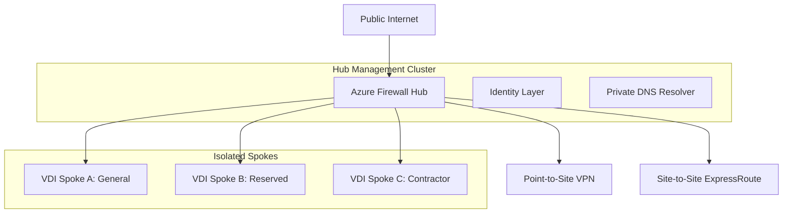

### 2. The Networking Lifecycle Flow (Deployment & Routing)
The continuous path of a network segment from initial segment provisioning and routing table calculation to forced hub tunneling and private endpoint registration. This ensures zero-interruption operations through dependency-aware networking flows.

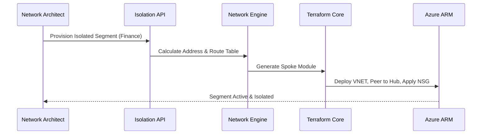

**Firewall Inspection Flow:**
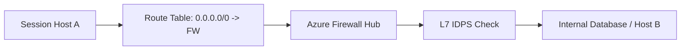

**Private Endpoint Lifecycle:**
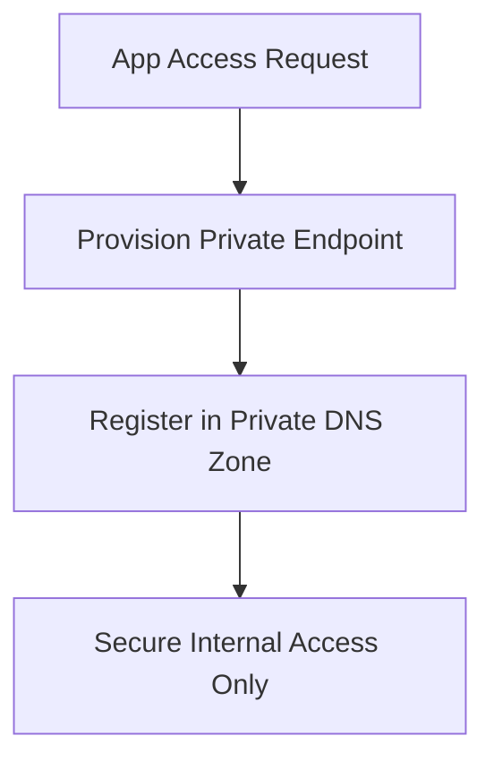

**Route Propagation Flow:**
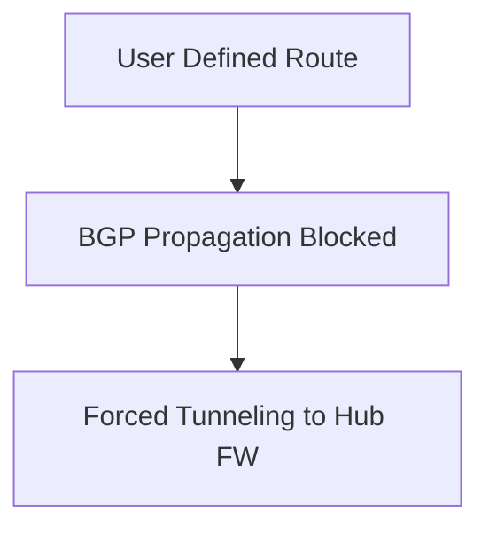

### 3. Distributed Networking Topology (Global Hubs & Sync)
Strategically orchestrating standardized networking across global hubs (EMEA, US) and regional spokes, providing a unified institutional view of network connectivity.

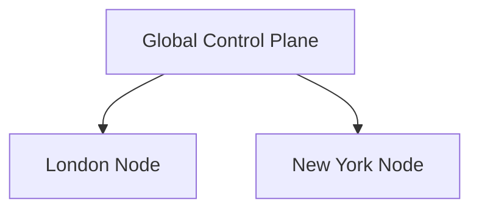

**AVD Global Topology:**
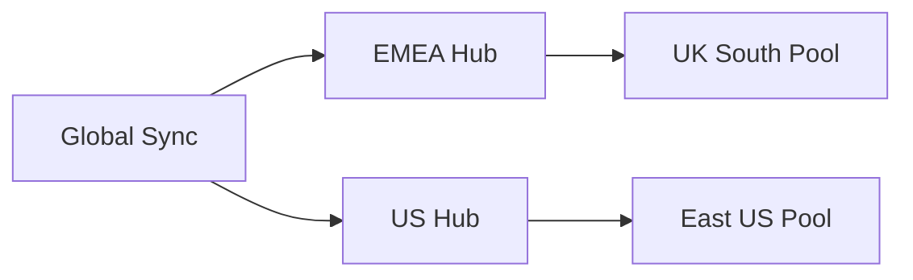

### 4. Governance Hub & Control Plane Flow
Executing complex logic for securing the bridge between network requests and hub-spoke topologies, ensuring every segment is authorized, metrics are aggregated, and executive oversight is maintained.

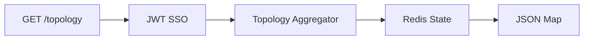

**Executive Governance Workflow:**
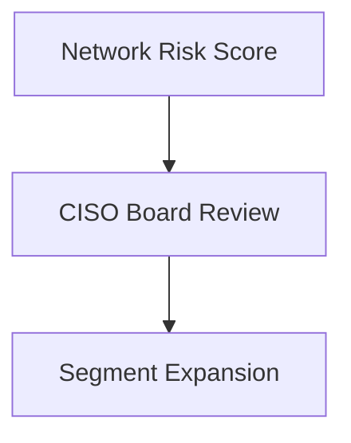

### 5. Multi-Cloud Networking Federation & Global Topology
Automatically managing unified network standards across diverse cloud tenants and global regions, ensuring institutional data residency and privacy boundaries by default.

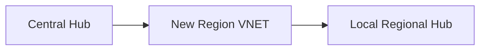

**DNS Failover Workflow:**
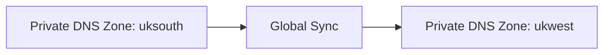

### 6. Encryption & Perimeter Protection Flow (Security Trust Boundary)
Managing the lifecycle of a networking request, automatically enforcing institutional MFA and segment isolation standards as required by security policy, ensuring zero-latency security confidence.

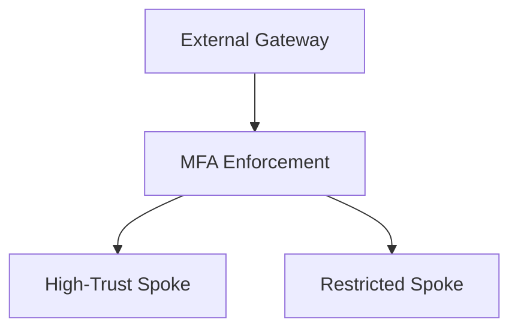

**Contractor Isolated Zone Flow:**
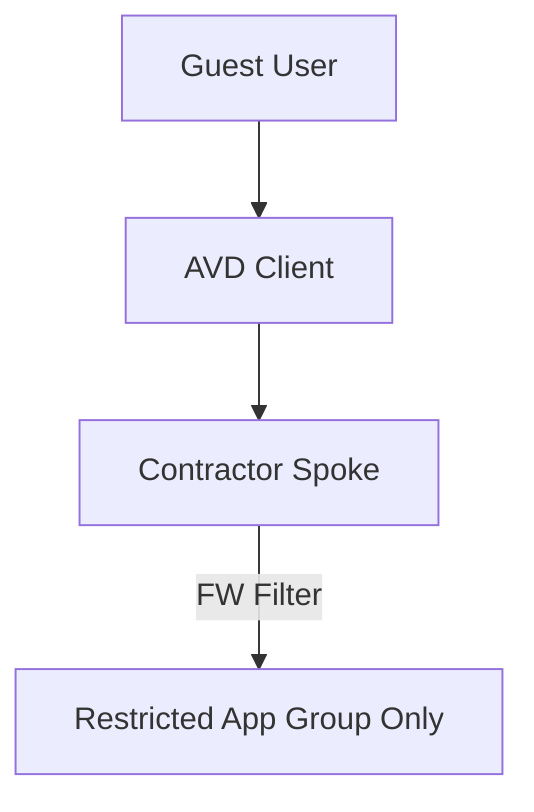

### 7. Institutional Networking Maturity Scorecard (Diagnostic Engine)
Grading organizational performance based on key indicators: Reachability Compliance, Network Risk Scores, and Connectivity Analytics.

### 8. Identity & RBAC for Networking Governance
Managing fine-grained access to networking hubs, provisioning workers, and audit logs between Global Enterprise Management and Business Unit segments.

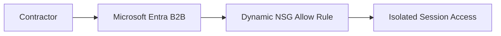

**Multi-Tenant Tenancy Model:**
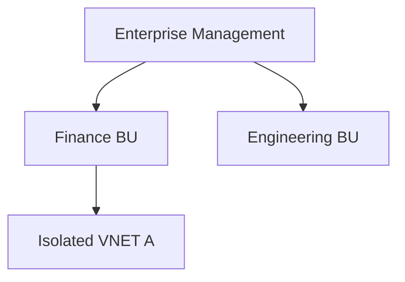

### 9. IaC Deployment: AVD-Network-Isolation-as-Code Framework
Using modular CI/CD pipelines to deploy and manage the versioned distribution of the hub modules, Terraform lintings, and validation fleets.

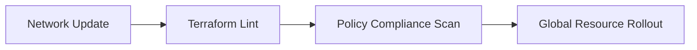

### 10. AIOps Networking Drift & Risk Validation Flow
Using advanced analytics to identify sudden surges in connectivity failures, unauthorized routing changes, or unusual delivery pattern changes that could result in institutional risk or downtime.

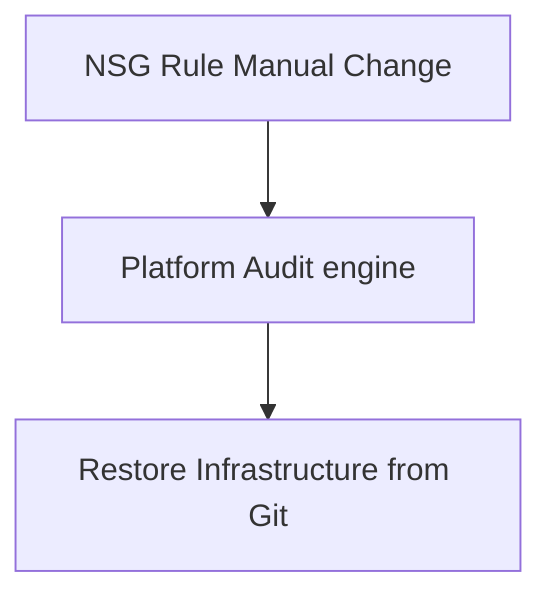

**Connectivity Diagnostics Workflow:**
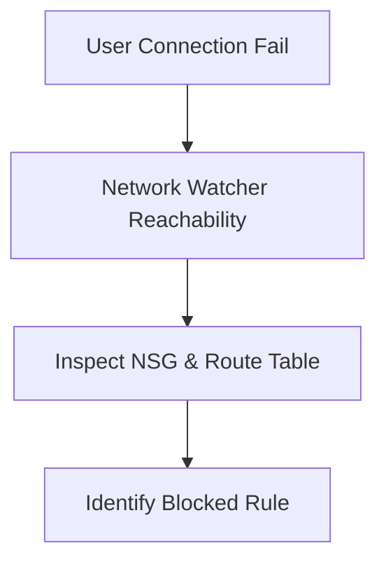

**Disaster Recovery Topology:**
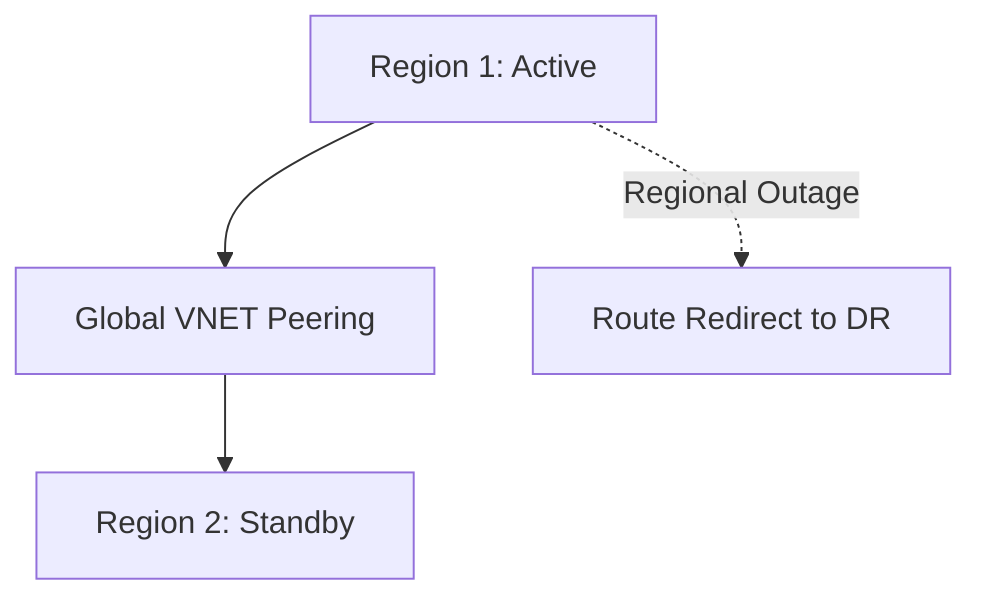

### 11. Metadata Lake for Forensic Networking Audit
Storing long-term records of every network integration event (metadata), every segment expanded, and every flow log telemetry for institutional record-keeping and forensic analysis.

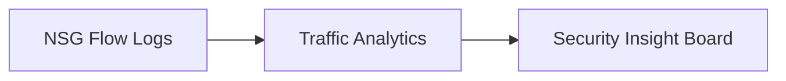

---

## 🏛️ Core Governance Pillars

1.  **Unified Foundation Coordination**: Maximizing resilience by centralizing all network measurement through a single institutional plane.
2.  **Automated Workspace Provisioning**: Eliminating "manual tracking" scenarios through proactive orchestration and pattern verification.
3.  **Sequential Networking Intelligence**: Ensuring zero-interruption operations through dependency-aware routing-driven data engineering.
4.  **Zero-Trust Identity Protection**: Automatically enforcing identity-based access, segment encryption, and policy evaluation across all assurance tiers.
5.  **Autonomous Operations Logic**: Guaranteeing reliability through automated industry-specific effectiveness monitoring runbooks.
6.  **Full Networking Auditability**: Immutable recording of every network change and isolation provision for institutional forensics.

---

## 🛠️ Technical Stack & Implementation

### Networking Engine & APIs
*   **Framework**: Python 3.11+ / FastAPI.
*   **Performance Engine**: Custom Python-based logic for multi-cloud network reconciliation and DORA-style EUC metrics.
*   **Integrations**: Native connectors for Azure ARM, Terraform, and Azure Network Watcher.
*   **Persistence**: PostgreSQL (Networking Ledger) and Redis (Live Connectivity State).
*   **Auth Orchestrator**: Federated OIDC/SAML for least-privilege networking management access.

### Governance Dashboard (UI)
*   **Framework**: React 18 / Vite.
*   **Theme**: Dark, Slate, Indigo (Modern high-fidelity productivity aesthetic).
*   **Visualization**: D3.js for delivery topologies and Recharts for ROI velocity analytics.

### Infrastructure & DevOps
*   **Runtime**: AWS EKS or Azure Kubernetes Service (AKS) for management plane.
*   **Measurement Hub**: Managed event sourcing for immutable productivity timeline reconstruction.
*   **IaC**: Modular Terraform for deploying the networking landing zone and validation fleet.

---

## 🏗️ IaC Mapping (Module Structure)

| Module | Purpose | Real Services |
| :--- | :--- | :--- |
| **`infrastructure/networking_hub`** | Central management plane | EKS, PostgreSQL, Redis |
| **`infrastructure/enforcers`** | Distributed segment provisioners | Azure, AWS, GCP APIs |
| **`infrastructure/networking_pipes`** | Data Ingestion Hubs | Webhooks, Lambda |
| **`infrastructure/auditing`** | Forensic modernization sinks | S3, Athena, Quicksight |

---

## 🚀 Deployment Guide

### Local Principal Environment
```bash
# Clone the AVD Network Isolation repository
git clone https://github.com/devopstrio/avd-network-isolation.git
cd avd-network-isolation

# Configure environment
cp .env.example .env

# Launch the Networking stack
make init

# Trigger a mock networking update and automated guardrail validation simulation
make simulate-isolation
```

Access the Management Portal at `http://localhost:3000`.

---

## 📜 License
Distributed under the MIT License. See `LICENSE` for more information.

---
<div align="center">
  <p>© 2026 Devopstrio. All rights reserved.</p>
</div>
