<div align="center">


<h1>Azure Virtual Desktop (AVD) Network Isolation</h1>

<p><strong>Zero-Trust Network Segmentation, Secure Connectivity & Multi-Region Containment</strong></p>

[](https://devopstrio.co.uk/)
[](https://devopstrio.co.uk/)
[](https://devopstrio.co.uk/)
[](/apps/inspection-engine)

</div>

---

## 🏛️ Executive Summary

The **AVD Network Isolation** platform is a flagship enterprise security foundation designed to deliver granular network segmentation and zero-trust connectivity for Azure Virtual Desktop (AVD) environments. In an era of sophisticated lateral movement threats, simple VNET-to-VNET connectivity is no longer sufficient. This platform provides the architectural guardrails to isolate developer labs, finance workstations, and contractor environments with absolute precision.

By automating the construction of **Hub-Spoke** topologies, **Private Link** integrations, and **Layer 7 Firewall Polices**, this platform ensures that traffic is inspected, authenticated, and authorized at every hop. It eliminates the need for public IP addresses on session hosts and enforces a "private-only" access pattern for both management and user traffic. The platform includes a dedicated Network Operations Command Center for real-time topology visualization, connectivity diagnostics, and policy drift remediation.

### Strategic Business Outcomes
- **Zero-Trust Connectivity**: Implement a "Deny-by-Default" posture across the entire global desktop fleet, reducing the lateral attack surface.
- **Regulated Workload Isolation**: Provide physically or logically isolated "Sovereign Zones" for highly sensitive banking, healthcare, or government desktops.
- **Improved Security Posture**: Enforce mandatory traffic inspection via Azure Firewall and centralized NVA clusters with automated rule lifecycle management.
- **Optimized Latency**: Accelerate connectivity through regional breakout and optimized routing tables, ensuring the best possible user experience for global engineering teams.

---

## 🏗️ Technical Architecture Details

### 1. High-Level Hub-Spoke Architecture
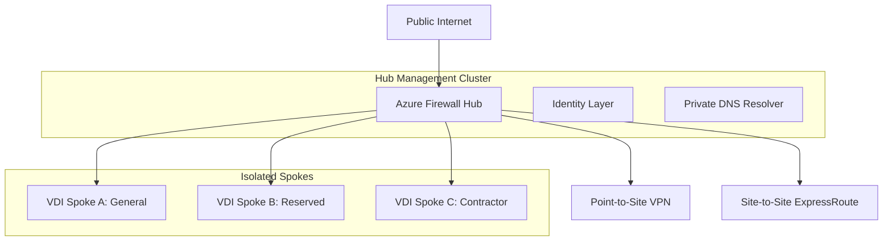

### 2. Hub-Spoke Deployment Workflow
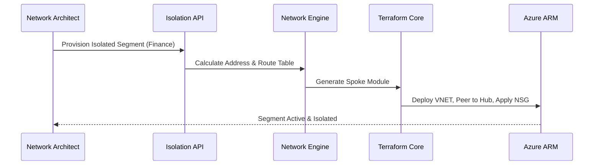

### 3. Firewall Inspection Flow (East-West)
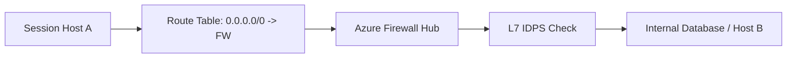

### 4. Private Endpoint Lifecycle
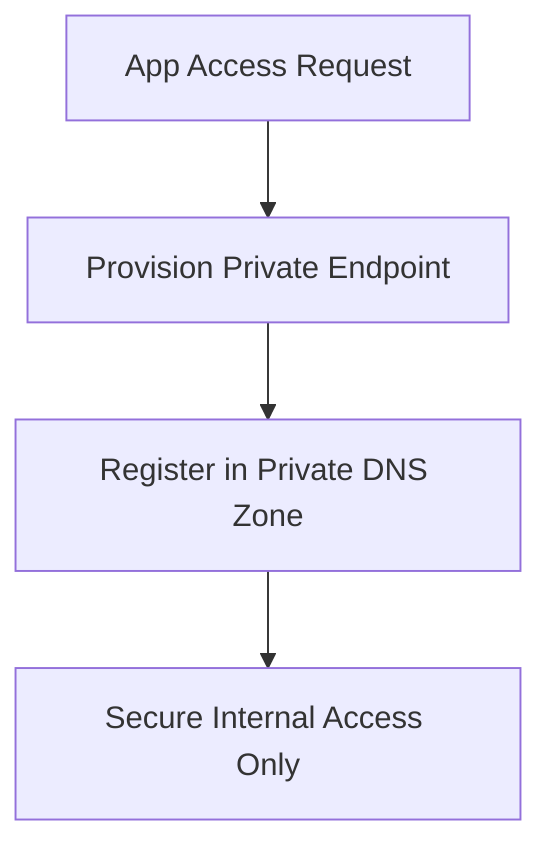

### 5. Connectivity Diagnostics Workflow
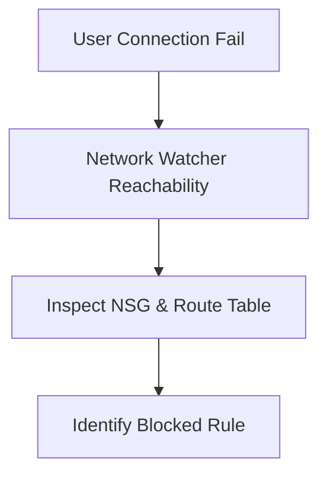

### 6. Security Trust Boundary
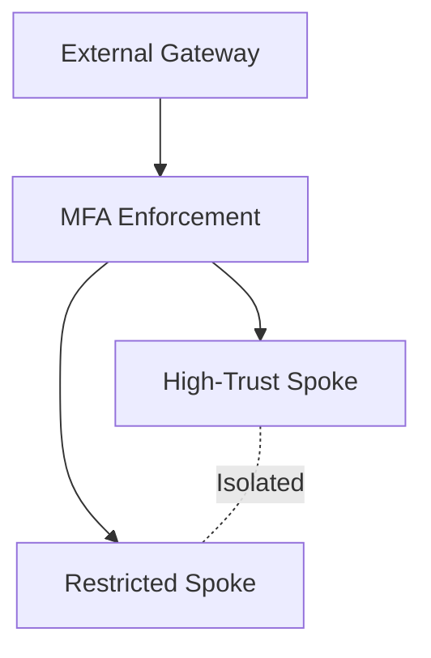

### 7. AVD Global Topology
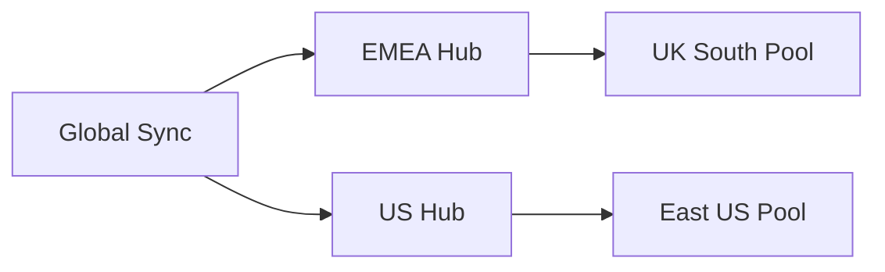

### 8. API Request Lifecycle
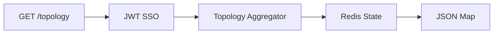

### 9. Multi-Tenant Tenancy Model
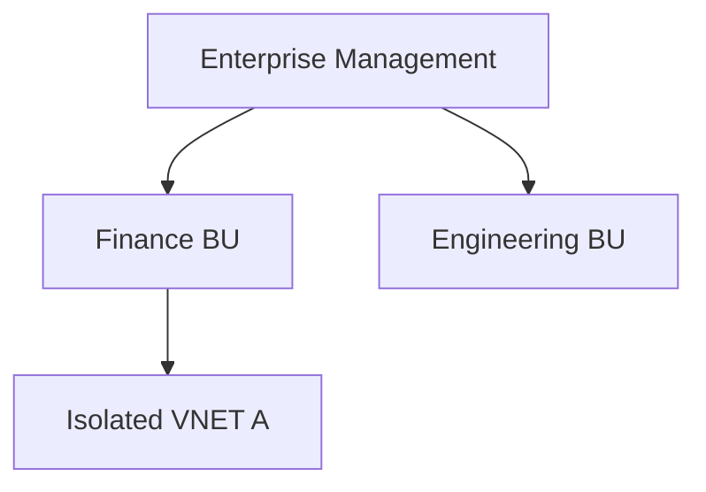

### 10. Monitoring & Telemetry Flow
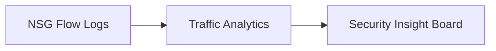

### 11. Disaster Recovery Topology
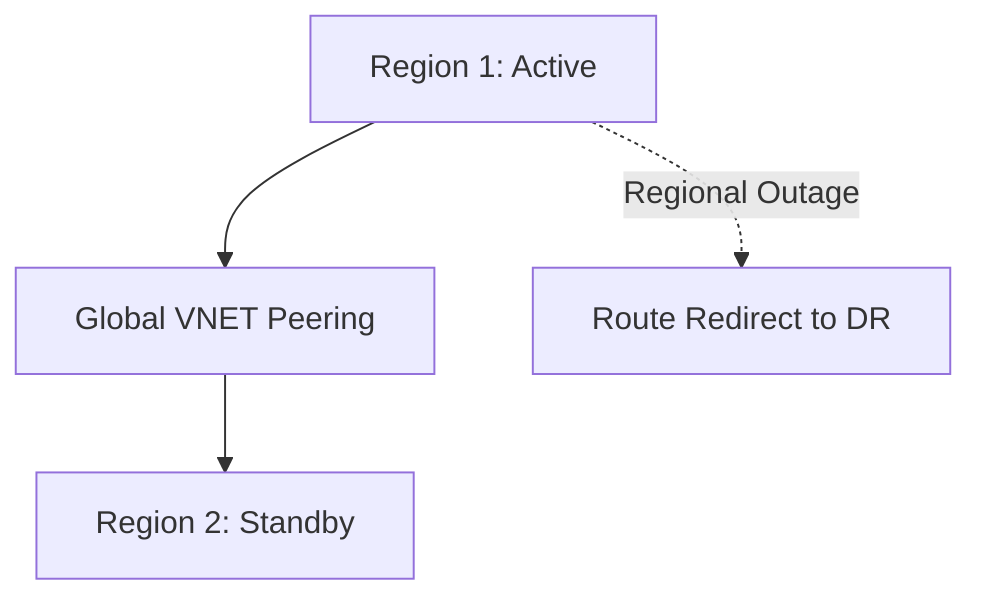

### 12. DNS Failover Workflow
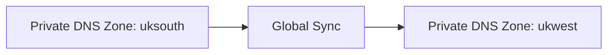

### 13. Identity Federation Model
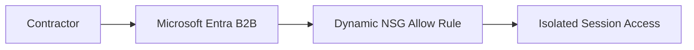

### 14. Contractor Isolated Zone Flow
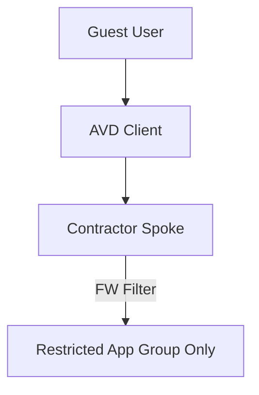

### 15. CI/CD Infrastructure Pipeline
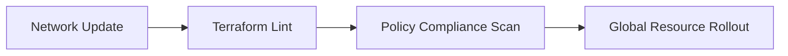

### 16. Executive Governance Workflow
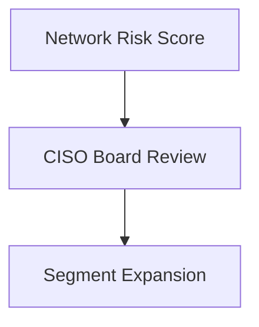

### 17. Region Expansion Topology
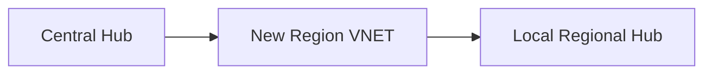

### 18. Route Propagation Flow
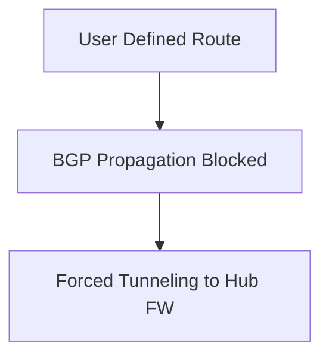

### 19. Global Region Topology
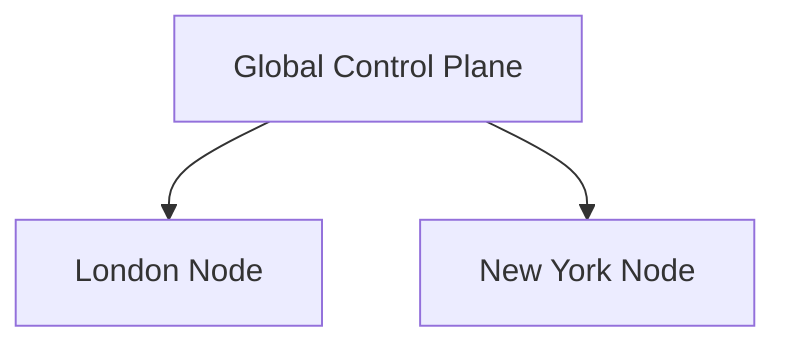

### 20. Policy Drift Remediation
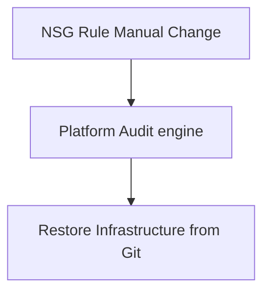

---

## 🚀 Experience The Platform

### Terraform Global Rollout
```bash
cd terraform/environments/prd
terraform init
terraform apply -auto-approve
```

---
<sub>&copy; 2026 Devopstrio &mdash; Engineering the Secure Zero-Trust Backbone for the Global Remote Workforce.</sub>
